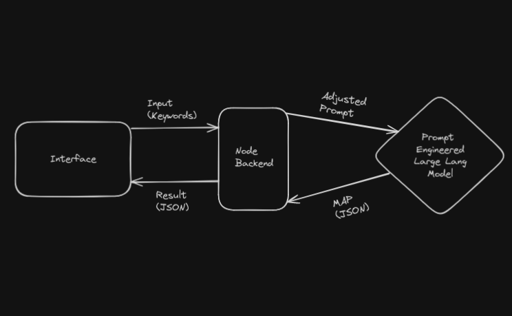
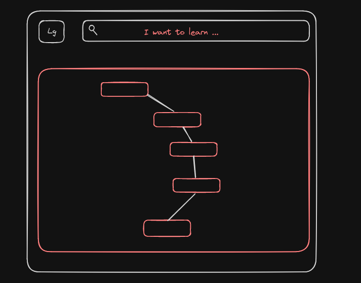

# Allmaps Map

#### Allmaps is a platform that provides AI powered roadmaps for achieving your goals, making it easier to learn skills or retrieve sequential information.


1. Allmaps is the platform which generated roadmaps for anything.
2. It leverages OpenAI API language model to generate roadmaps.
3. The model is finetuned and adjusted to generate roadmaps.
 
### Structure of the Output from Lang Model
#### For the example below, the prompt is asking I want to learn Java.
```JSON
[
  {
    "id": "a1b2c3d4-e5f6-7890-1234-567890abcdef",
    "title": "Basics Syntax",
    "attributes": [] 
  },
  {
    "id": "bb2ca3d4-e5f6-7890-1234-567890abcdef",
    "title": "Data Types",
    "attributes": ["Primitive Types", "Reference Types"]
  },
  {
    "id": "cc3da4e5-f678-9012-3456-7890abcdef12",
    "title": "Operators",
    "attributes": ["Arithmetic", "Logical", "Comparison"] 
  },
  {
    "id": "dd4ea5f6-7890-1234-5678-90abcdef123",
    "title": "Control Flow",
    "attributes": ["Conditional Statements", "Loops"]
  },
  {
    "id": "ee5fa6b7-8901-2345-6789-abcdef12345",
    "title": "OOP Concepts", 
    "attributes": ["Classes & Objects", "Inheritance", "Polymorphism", "Abstraction"]
  },
  {
    "id": "ff6ga7b8-9012-3456-7890-abcdef123456",
    "title": "Collections Framework",
    "attributes": ["Lists", "Sets", "Maps"]
  },
  {
    "id": "gg7ha8b9-0123-4567-890a-bcdef1234567",
    "title": "Exception Handling",
    "attributes": ["Try-Catch", "Finally", "Throw"]
  },
  {
    "id": "hh8ia9b0-1234-5678-90ab-cdef12345678",
    "title": "Input/Output",
    "attributes": ["File Handling", "Streams"]
  },
  {
    "id": "ii9ja0b1-2345-6789-0abc-def123456789",
    "title": "Concurrency",
    "attributes": ["Threads", "Synchronization"]
  },
  {
    "id": "jj0kb1c2-3456-7890-12ab-cdef123456789",
    "title": "Java Libraries",
    "attributes": ["JDBC", "Networking", "Swing/JavaFX"] 
  },
  {
    "id": "kk1lb2c3-4567-8901-23ab-cdef123456789",
    "title": "Build Tools",
    "attributes": ["Maven", "Gradle"] 
  },  {
    "id": "ll2mc3d4-5678-9012-34ab-cdef123456789",
    "title": "Testing Frameworks", 
    "attributes": ["JUnit", "TestNG"]
  } 
]
```


